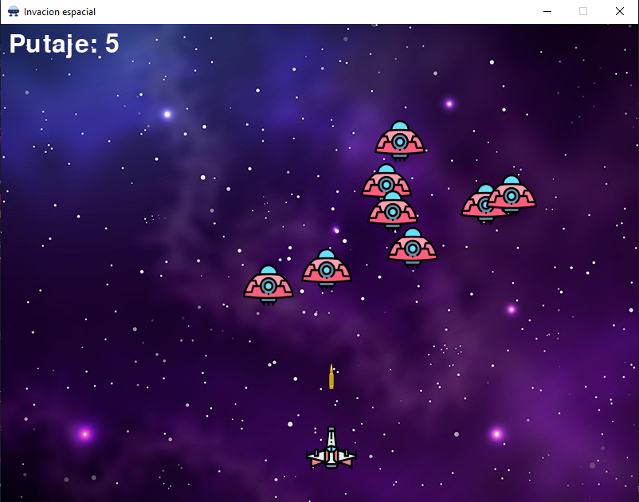

# 🚀 Invasión Espacial - Pygame Arcade

**Invasión Espacial** es una recreación del clásico juego de arcade *Space Invaders*, desarrollado en **Python** utilizando la librería **Pygame**. El jugador controla una nave espacial que debe defender la Tierra de una flota de enemigos alienígenas, esquivando sus movimientos y disparando para obtener la mayor puntuación posible.

Este proyecto demuestra el manejo de **sprites**, **colisiones**, **eventos de teclado** y **reproducción de audio** en tiempo real.


## 🎮 Gameplay



## ✨ Características

* **🕹️ Mecánicas Clásicas:** Movimiento lateral fluido y sistema de disparo.
* **👾 Enemigos Dinámicos:** Múltiples enemigos que se generan aleatoriamente y descienden hacia el jugador.
* **💥 Sistema de Colisiones:** Detección matemática de impactos (Bala vs Enemigo).
* **🔊 Audio Inmersivo:**
    * Música de fondo en bucle.
    * Efectos de sonido para disparos e impactos.
* **📊 Puntuación:** Contador de score en tiempo real en pantalla.
* **💀 Game Over:** Pantalla de fin de juego cuando los enemigos invaden la zona del jugador.

## 🕹️ Controles

| Tecla | Acción |
| :--- | :--- |
| **⬅️ Flecha Izquierda** | Mover Nave a la Izquierda |
| **➡️ Flecha Derecha** | Mover Nave a la Derecha |
| **Barra Espaciadora** | Disparar Láser |

## 🛠️ Tecnologías Utilizadas

* **[Python](https://www.python.org/):** Lenguaje principal.
* **[Pygame](https://www.pygame.org/):** Librería para el desarrollo de videojuegos (gráficos y sonido).
* **Math & Random:** Módulos nativos para la lógica de colisiones y generación aleatoria.

## 📂 Recursos Necesarios (Assets)

Para ejecutar este juego, asegúrate de tener los siguientes archivos en la misma carpeta que el script `main.py`:

* `fondo.jpg` (Imagen de fondo)
* `nave-espacial.png` (Sprite del jugador)
* `enemigo.png` (Sprite del enemigo)
* `bala.png` (Sprite del disparo)
* `ovni.png` (Icono de la ventana)
* `MusicaFondo.mp3` (Música ambiental)
* `disparo.mp3` (SFX)
* `golpe.mp3` (SFX)

## ⚙️ Instalación y Ejecución

1.  **Clonar el repositorio:**
    ```bash
    git clone [https://github.com/tu-usuario/invacion-espacila-python.git](https://github.com/tu-usuario/invacion-espacila-python.git)
    ```

2.  **Instalar Pygame:**
    Si no tienes la librería instalada, ejecuta:
    ```bash
    pip install pygame
    ```

3.  **Jugar:**
    Ejecuta el archivo principal:
    ```bash
    python main.py
    ```

## ✒️ Autor

**Gastón Cane**
* Estudiante de Tecnicatura Superior en Ciencia de Datos e Inteligencia Artificial.
* Estudiante de Tecnicatura Superior en Desarrollo de Software.
* Instituto Politécnico Superior Córdoba.

---
*Desarrollado con fines educativos y de entretenimiento.*
